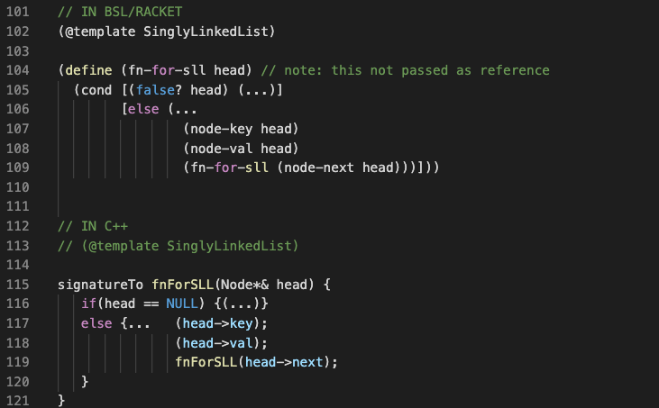

# Data-Driven Templates for CPSC 221

This extension provides templates for functions operating on popular data types used in CPSC 221. The use of templates provide type safety, so that you can better focus on finishing the function, and not worry too much about type safety problems; all while producing consistent code. 

## Features

There are multiple great features in using templates.
### HtDP-Style Templates

The template snippet set uses the style of data-driven templates used in HtDP or CPSC 110 @ UBC. The above image shows how a template for a singly linked-list can be shown in Racket and C++. 

> Tip: The template for C++ always provides parameters in Pass-By-Reference rather than Pass-By-Value. However, that part of the template is easily modifiable.

## Requirements

If you have any requirements or dependencies, add a section describing those and how to install and configure them.

## Extension Settings

Include if your extension adds any VS Code settings through the `contributes.configuration` extension point.

For example:

This extension contributes the following settings:

* `(@template LinkedList)`: template for linkedlist
* `(@template SinglyLinkedList)`: template for singly linked list
* `(@template DoublyLinkedList)`: template for doubly linked list
* `(@template 2-one-of)`: template for 2-one-of, with cross product table

## Known Issues

Calling out known issues can help limit users opening duplicate issues against your extension.

## Release Notes

Users appreciate release notes as you update your extension.

### 1.0.0

Initial release of CPSC 221 - Data Driven Templates
-----------------------------------------------------------------------------------------------------------

## Working with Markdown

**Note:** You can author your README using Visual Studio Code.  Here are some useful editor keyboard shortcuts:

* Split the editor (`Cmd+\` on macOS or `Ctrl+\` on Windows and Linux)
* Toggle preview (`Shift+CMD+V` on macOS or `Shift+Ctrl+V` on Windows and Linux)
* Press `Ctrl+Space` (Windows, Linux) or `Cmd+Space` (macOS) to see a list of Markdown snippets

### For more information

* [Visual Studio Code's Markdown Support](http://code.visualstudio.com/docs/languages/markdown)
* [Markdown Syntax Reference](https://help.github.com/articles/markdown-basics/)

**Enjoy!**
